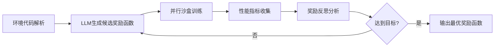

# LEMS: LLM-Enhanced Multi-Agent Pursuit System
# 基于大语言模型的多智能体强化学习奖励函数自动生成系统

<div align="center">


**一个结合大语言模型（LLM）与多智能体强化学习（MARL）的创新研究项目**

[项目背景](#项目背景) • [核心特性](#核心特性) • [系统架构](#系统架构) • [快速开始](#快速开始) • [实现计划](#实现计划)

</div>

---

## 📋 项目简介

本项目旨在解决多智能体强化学习（MARL）中**奖励函数设计困难**的核心问题。通过引入大语言模型（LLM）作为"高级奖励工程师"，实现奖励函数的自动化设计与进化优化。

### 应用场景：多智能体围捕任务

- **环境**: PettingZoo MPE Simple Tag (自定义扩展)
- **任务**: 3个追捕智能体协同围捕1个逃逸目标
- **算法**: MADDPG (Multi-Agent Deep Deterministic Policy Gradient)
- **创新点**: LLM自动生成与优化奖励函数代码

---

## 🎯 核心特性

### 1. 智能奖励函数设计
- ✅ **自动代码生成**: LLM理解环境物理规律，生成Python奖励函数代码
- ✅ **进化式优化**: 基于训练反馈迭代改进奖励函数
- ✅ **多目标平衡**: 自动权衡接近目标、避免碰撞、队形保持等多个子目标

### 2. 完整的MARL训练系统
- ✅ MADDPG算法实现（已完成）
- ✅ 自定义多智能体环境（已完成）
- ✅ 并行训练与评估框架（已完成）
- ✅ 可视化渲染与轨迹分析（已完成）

### 3. Agent架构设计
基于**EUREKA**论文思想，构建循环式智能体（Loop-Based Agent）:

```
感知（Perception）   →   大脑（Brain: LLM）    →   行动（Action: 代码生成）
     ↑                                                      ↓
记忆（Memory）        ←   反思（Reflection）    ←   执行（Tool: 仿真训练）
```

---

## 🏗️ 系统架构

### 整体工作流程



### 技术栈

| 组件 | 技术选型 | 用途 |
|------|---------|------|
| **强化学习框架** | PyTorch + PettingZoo | MARL训练环境 |
| **大语言模型** | GPT-4 / Claude / 国产大模型 | 奖励函数生成与反思 |
| **Agent框架** | LangChain / LangGraph | 循环式智能体状态管理 |
| **并行训练** | Python Multiprocessing | 多候选函数并行验证 |
| **日志分析** | TensorBoard + 自定义指标 | 训练反馈与可视化 |

---

## 📁 项目结构

```
LEMS/
├── MADDPG/                          # 现有MADDPG实现（基础）
│   ├── agents/                      # MADDPG智能体定义
│   ├── envs/                        # 自定义围捕环境
│   │   ├── simple_tag_env.py        # 主环境文件
│   │   └── custom_agents_dynamics.py # 自定义动力学
│   ├── utils/                       # 工具模块
│   │   ├── runner.py                # 训练执行器
│   │   └── logger.py                # 日志记录
│   ├── main_train.py                # 训练主程序
│   ├── main_evaluate.py             # 评估主程序
│   └── models/                      # 保存的模型权重
│
├── llm_reward_agent/                # 【待开发】LLM奖励设计智能体
│   ├── agent/                       # Agent核心逻辑
│   │   ├── reward_design_agent.py   # 主Agent类
│   │   ├── prompt_templates.py      # LLM提示词模板
│   │   └── memory.py                # 进化记忆管理
│   ├── tools/                       # Agent工具集
│   │   ├── code_writer.py           # 代码写入工具
│   │   ├── simulation_tool.py       # 仿真执行工具
│   │   └── log_analyzer.py          # 日志分析工具
│   ├── workflow/                    # LangGraph工作流定义
│   │   └── evolution_graph.py       # 进化循环流程图
│   └── config/                      # 配置文件
│       └── llm_config.yaml          # LLM参数配置
│
├── experiments/                     # 【待开发】并行实验沙盒
│   ├── candidate_0/                 # 候选奖励函数1
│   ├── candidate_1/                 # 候选奖励函数2
│   └── ...
│
├── reward_templates/                # 【待开发】奖励函数模板库
│   ├── base_reward.py               # 基础奖励模板
│   └── reward_components.py         # 可组合奖励组件
│
├── launcher.py                      # 【待开发】并行训练启动器
├── README.md                        # 本文件
└── IMPLEMENTATION_PLAN.md           # 详细实现计划
```

---

## 🚀 快速开始

### 环境配置

#### 1. 安装依赖（现有MADDPG）

```bash
# 创建虚拟环境
conda create -n lems python=3.8
conda activate lems

# 安装基础依赖
cd MADDPG
pip install -r utils/pip-requirements.txt

# 或使用conda环境
conda env create -f utils/conda-environment.yml
```

#### 2. 测试现有MADDPG训练

```bash
cd MADDPG
python main_train.py --env_name simple_tag_env --episode_num 5000
```

#### 3. 评估与可视化

```bash
# 评估训练好的模型
python main_evaluate.py

# 生成GIF动画
python main_evaluate_save_render2gif.py

# 使用matplotlib渲染
python main_evaluate_matplotlib.py
```

---

## 📊 现有成果展示

### 训练曲线
项目已完成基础MADDPG训练，保存有多个训练日志：
- 成功率、奖励曲线、损失函数等指标
- 数据存储于 `MADDPG/logs/` 和 `MADDPG/plot/data/`

### 渲染动画
提供多种可视化方式：
- RGB数组渲染（PettingZoo原生）
- Matplotlib自定义渲染（带轨迹追踪）
- GIF动画生成

示例输出位于 `renders_matplotlib/` 文件夹。

---

## 🎓 理论基础

### EUREKA框架映射

本项目核心思想源自NVIDIA的**EUREKA**论文，将其组件映射为Agent标准结构：

| EUREKA组件 | Agent组件 | 本项目实现 |
|-----------|----------|----------|
| Reward Designer | Brain (大脑) | LLM（GPT-4等） |
| Code Execution | Action (行动) | 代码写入 + 仿真训练 |
| Training Feedback | Perception (感知) | 日志解析 + 指标提取 |
| Evolution Archive | Memory (记忆) | 历史最优代码库 |
| Reflection | Reasoning (推理) | LLM分析训练日志生成改进建议 |

### 奖励函数设计挑战

在多智能体围捕任务中，奖励函数需要平衡：
1. **任务目标**: 接近并围捕目标
2. **安全约束**: 避免智能体之间碰撞
3. **协同行为**: 保持队形、均匀分布包围圈
4. **效率优化**: 最小化能耗、最短时间完成任务

传统方法需要人工反复调试权重系数（$\alpha, \beta, \gamma$...），而LLM可以：
- 理解物理约束（观测空间、动作空间）
- 生成多样化的候选方案
- 基于训练反馈自动调优

---

## 🛠️ 后续开发计划

### 第一阶段：环境接口标准化（1-2周）
- [ ] 剥离奖励计算逻辑为独立模块 `reward_function.py`
- [ ] 增强日志系统，记录奖励分量统计（距离奖励、碰撞惩罚等）
- [ ] 添加协同行为指标（围捕角方差、编队质量等）

### 第二阶段：LLM Agent开发（2-3周）
- [ ] 实现 `RewardDesignAgent` 核心类
- [ ] 编写环境代码解析与提示词生成逻辑
- [ ] 集成LLM API（OpenAI/Anthropic/国产模型）
- [ ] 实现进化记忆管理

### 第三阶段：并行训练框架（1-2周）
- [ ] 开发 `launcher.py` 并行调度器
- [ ] 实现沙盒隔离与文件管理
- [ ] 完成训练监控与结果收集

### 第四阶段：反馈闭环（1周）
- [ ] 实现日志分析工具
- [ ] 开发奖励反思生成逻辑
- [ ] 完成进化循环整合

### 第五阶段：实验与优化（2-3周）
- [ ] 在围捕任务上进行多轮进化实验
- [ ] 对比人工设计 vs LLM设计的奖励函数
- [ ] 撰写论文与答辩准备

**总计：7-11周（约2-3个月）**

详见 [IMPLEMENTATION_PLAN.md](./IMPLEMENTATION_PLAN.md)

---

## 📚 参考文献

1. **EUREKA**: Human-Level Reward Design via Coding Large Language Models (NVIDIA, 2023)
2. **MADDPG**: Multi-Agent Actor-Critic for Mixed Cooperative-Competitive Environments (OpenAI, 2017)
3. **PettingZoo**: A Standard API for Multi-Agent Reinforcement Learning (Farama Foundation)
4. **LangChain/LangGraph**: Framework for developing applications powered by language models

---

## 👥 作者信息

**项目类型**: 本科/硕士毕业设计  
**研究方向**: 多智能体强化学习 × 大语言模型  
**关键词**: MARL, Reward Engineering, LLM Agent, MADDPG, Multi-UAV Pursuit

---

## 📄 许可证

MIT License - 详见 [LICENSE](./LICENSE) 文件

---

## 🙏 致谢

- PettingZoo团队提供的优秀多智能体环境
- NVIDIA EUREKA项目的启发性研究
- OpenAI关于MADDPG的开源实现

---

<div align="center">

**如果这个项目对你有帮助，欢迎 ⭐ Star 支持！**

</div>
